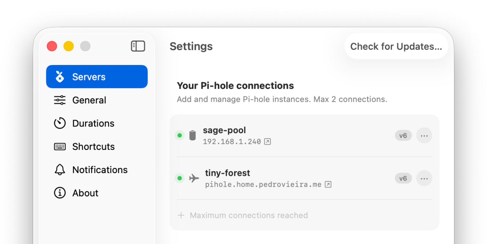

<p align="center">
  
</p>

<h1 align="center">Holeberry</h1>

<p align="center">
  <a href="README.md">English</a> ·
  <a href="README.zh-CN.md">简体中文</a> ·
  <a href="README.ja.md">日本語</a> ·
  <a href="https://holeberryapp.com">Website</a>
</p>

<p align="center">
  <b>Your Pi-hole, right in the menu bar.</b><br />
  A native and modern macOS menu bar app to monitor and control your Pi-hole® instances. No browser tab required.
</p>

<p align="center">
  
  
  
  
  
</p>


## What is Holeberry?

Holeberry is a lightweight macOS menu bar app that puts your Pi-hole® at your fingertips. Check blocking status and query stats, disable blocking for a few seconds or a custom duration, unblock the domain in your current browser tab, and allowlist or unblock recently-blocked domains — all without opening the Pi-hole web interface.

It supports Pi-hole® **v6** and **v5** (*not fully tested*), multiple instances, and global keyboard shortcuts.

## Installation

1. Download the latest `Holeberry-<version>.dmg` from the [Releases](https://github.com/pedrovieira/Holeberry/releases) page.
2. Open the DMG and drag **Holeberry** into your `Applications` folder.

**Note on macOS Gatekeeper:** Holeberry is built with a free Apple ID, so the app is not notarized with a paid Apple Developer account. macOS may therefore flag it as an unidentified developer or quarantine it on first launch. If you see that warning, remove the quarantine flag and launch again:

```bash
xattr -dr com.apple.quarantine /Applications/Holeberry.app
```

## Requirements

- **macOS 14 (Sonoma) or later** — Holeberry is built with Swift 6 and takes advantage of modern macOS APIs.
- A Pi-hole® instance (v6 or v5) reachable from your Mac, on your local network or elsewhere.

## Features

### Status at a glance

The menu bar icon reflects your Pi-hole®'s health at all times, with per-instance status for multi-server setups:

- 🟢 **Blocking Active** — everything is blocking as expected
- ⚪ **Blocking Disabled** — blocking is off (or on a timer)
- 🟠 **Blocking Partially Active** — your instances disagree with each other
- 🔴 **Instance Unreachable** — one or more instances can't be reached

The menu also shows **total queries and blocked domains** across all your instances.

### Multiple instances

Manage several Pi-hole instances from one menu: per-server status dots, aggregated query/blocked stats, and clear warnings when an instance is down or instances disagree on blocking state.

<p align="center">
  
</p>

### Disable blocking with a timer

Turn blocking off for **10 seconds, 30 seconds, 5 minutes, a custom duration**, or **indefinitely** — blocking re-enables automatically when the timer expires. No more forgetting to turn the ads back on.

### Unblock the tab you're on

Holeberry detects the current tab in **Safari, Chrome/Chromium, Firefox, and Zen Browser** and lets you unblock that exact domain — for 10 seconds, 30 seconds, 5 minutes, or a custom duration — or add it to your allowlist. Perfect for that one broken link or video that refuses to load.

### Recently blocked

Browse the domains Pi-hole blocked recently (from your Mac or all clients), and unblock or allowlist any of them straight from the menu.


## What's next?

Holeberry is a Pi-hole app today, but the menu bar workflow doesn't have to stop there. If there's enough community interest, future versions could add:

- **Support for other DNS providers** — AdGuard Home and Technitium are natural candidates, for people who don't run Pi-hole.
- **Mixed setups** — connect Pi-hole and AdGuard Home (or any combination) side by side, with per-instance status, aggregated stats, and the same one-click controls across providers.

None of this is a commitment — it's a wishlist, and demand decides the order. If you'd like to see any of these, open an [issue](https://github.com/pedrovieira/Holeberry/issues).

## FAQ

### Where are my Pi-hole credentials stored?
In the macOS **Keychain** — the same secure storage used by Mail, Safari, and your system. Holeberry never writes passwords to disk.

### What permissions does Holeberry need, and why?
- **Local Network**: required to connect to your Pi-hole instances.
- **Automation** (browser access): optional, only used when browser-tab unblocking is enabled. You can disable it anytime in Settings → General.

### Does Holeberry replace the Pi-hole web interface?
No, and it's not meant to. Holeberry is the remote control for the actions you take daily: status, toggling, and targeted unblocking. For deep configuration (adlists, DHCP, gravity updates), the web interface remains the tool.

### Why doesn't my browser tab appear?
Browser-tab unblocking must be enabled in Settings → General, and Holeberry needs Automation permission for your browser (granted via System Settings on first use).

## Building from source

```bash
git clone https://github.com/pedrovieira/Holeberry.git
cd Holeberry
open Holeberry.xcodeproj
```

Select the **Holeberry** scheme and hit Run (⌘R).

Notes for contributors:

- The project uses [XcodeGen](https://github.com/yonaskolb/XcodeGen) — if you change `project.yml`, regenerate with `xcodegen generate`.
- The app target has pre-build scripts running [SwiftLint](https://github.com/realm/SwiftLint) and `swift-format` in strict mode; install them or the build will warn.
- Core logic lives in the `HoleberryCore` Swift package with its own test suite — `cd Packages/HoleberryCore && swift test`.

## Contributing

Bug reports and feature requests are welcome via [issues](https://github.com/pedrovieira/Holeberry/issues). PRs should target the `main` branch, and the existing test suites should pass. AI-assisted contributions are welcome — if your PR was produced with AI assistance, please note it in the PR description and name the tool you used. Please open an issue first if you're planning something substantial — it saves both of us time.

## AI-assisted development

This project was primarily written by AI. I want to be upfront about that — but it was heavily guided by a human: me. AI generated and refined most of the code, but the architecture, the features, the scope, and the design decisions were directed and reviewed by me at every step. Treat the AI as an accelerator, not an author: the choices that make this codebase what it is — protocol-driven design, a testable core extracted into `HoleberryCore`, Swift 6 strict concurrency — are human choices. AI just made it faster to get there.

## Acknowledgements

- [Sparkle](https://github.com/sparkle-project/Sparkle) — update framework
- [KeyboardShortcuts](https://github.com/sindresorhus/KeyboardShortcuts) — global shortcut recording
- [Defaults](https://github.com/sindresorhus/Defaults) — typed user defaults
- [SymbolPicker](https://github.com/SzpakKamil/SymbolPicker) — instance icon picker
- [XcodeGen](https://github.com/yonaskolb/XcodeGen) — project generation
- [SwiftLint](https://github.com/realm/SwiftLint) and `swift-format` — keeping the code honest


---

*Pi-hole® is a registered trademark of Pi-hole LLC. Holeberry is an independent project and is not affiliated with Pi-hole LLC.*
