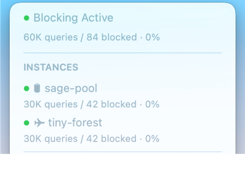
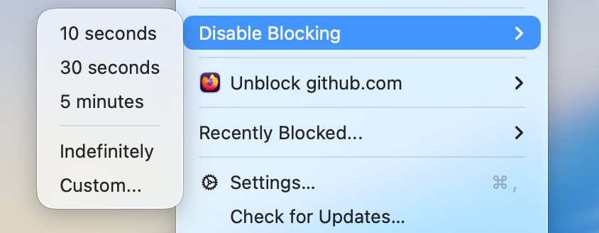
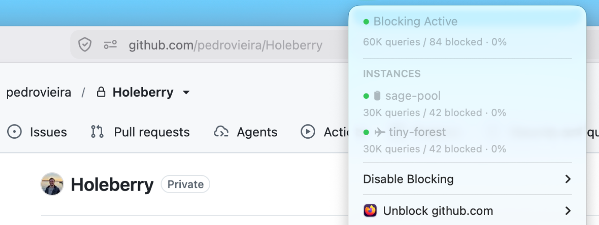

<p align="center">
  
</p>

<h1 align="center">Holeberry</h1>

<p align="center">
  <a href="README.md">English</a> ·
  <a href="README.zh-CN.md">简体中文</a> ·
  <a href="README.ja.md">日本語</a> ·
  <a href="https://holeberryapp.com">Website</a>
</p>

<p align="center">
  <b>Pi-hole 就在你的菜单栏里。</b><br />
  一款原生、现代的 macOS 菜单栏应用，用于监控和控制你的 Pi-hole® 实例——无需打开浏览器标签页。
</p>

<p align="center">
  
  
  
  
  
</p>

## Holeberry 是什么？

Holeberry 是一款轻量级 macOS 菜单栏应用，让你的 Pi-hole® 触手可及。查看屏蔽状态与查询统计、按指定时长或无限期禁用屏蔽、解除当前浏览器标签页中域名的屏蔽，以及将最近被屏蔽的域名加入白名单或解除屏蔽——全程无需打开 Pi-hole 网页管理界面。

它支持 Pi-hole® **v6** 与 **v5**（*未经充分测试*）、多实例以及全局键盘快捷键。

## 安装

1. 从 [Releases](https://github.com/pedrovieira/Holeberry/releases) 页面下载最新的 `Holeberry-<版本号>.dmg`。
2. 打开 DMG，将 **Holeberry** 拖入你的 `Applications` 文件夹。

Holeberry 使用 Developer ID 签名，并已通过 Apple 完全公证（notarization）。

## 系统要求

- **macOS 14（Sonoma）或更高版本** —— Holeberry 基于 Swift 6 构建，充分利用了现代 macOS API。
- 一台可从你的 Mac 访问的 Pi-hole® 实例（v6 或 v5），位于本地网络或其他位置均可。

## 功能特性

### 多实例

在一个菜单中管理最多**两个 Pi-hole® 实例**。你在 Holeberry 中执行的每个操作——屏蔽、解除屏蔽、白名单更改等——都会**同时应用到所有实例**。

这一点很重要：无法保证你的 Mac 只会使用第一个 DNS 服务器。有了 Holeberry，所有实例始终保持同步。每个服务器的状态圆点和聚合统计都直接显示在菜单中。

<p align="center">
  
</p>

### 状态一目了然

菜单栏图标会实时反映你的 Pi-hole® 的健康状况，多服务器场景下支持按实例显示状态。菜单还会显示所有实例的**总查询量与屏蔽域名数**。

<p align="center">
  
</p>

### 定时关闭屏蔽

快速**全局**禁用屏蔽，作用于所有 Pi-hole® 实例，持续指定时长或无限期。菜单栏中的**计时器胶囊**会显示倒计时，时间一到，屏蔽将自动重新启用。

<p align="center">
  
</p>

### 解除当前浏览器标签页的屏蔽

Holeberry 能检测 **WebKit（Safari、Orion）、Chrome/Chromium、Gecko（Firefox、Zen 等）**中的当前标签页，一键解除该域名的屏蔽——当页面因 Pi-hole 屏蔽而无法加载时尤其好用。查看[支持的浏览器完整列表](docs/SUPPORTED-BROWSERS.md)。

解除单个域名的屏蔽胜过全局禁用：页面能正常加载，网络的其他部分仍然受到保护。（你的智能电视可不会同意——它向外界发送的流量实在太多，恨不得来个全局解除。别听它的。）你也可以顺手把该域名加入白名单。

<p align="center">
  
</p>

### 最近被屏蔽的域名

浏览 Pi-hole® 最近屏蔽的域名（来自你的 Mac 或所有客户端），并直接在菜单中解除屏蔽或加入白名单。

## 未来计划

Holeberry 目前是一款面向 Pi-hole® 的应用，但菜单栏的工作流不必止步于此。如果有足够的社区需求，未来的版本可能会加入：

- **对其他 DNS 提供商的支持** —— AdGuard Home 和 Technitium 是自然而然的选择，适合不使用 Pi-hole® 的用户。
- **混合部署** —— 同时连接 Pi-hole® 与 AdGuard Home（或任意组合），按实例显示状态、汇总统计，并在不同提供商之间提供一致的一键操作。

这些都不是承诺——这是一份愿望清单，优先级由社区需求决定。如果你想看到其中任何一项，请开一个 [issue](https://github.com/pedrovieira/Holeberry/issues)。

## 常见问题

### 我的 Pi-hole 凭据存储在哪里？
在 macOS **钥匙串（Keychain）** 中——与邮件、Safari 和系统使用的安全存储相同。Holeberry 绝不会将密码写入磁盘。

### 可以使用没有密码的 Pi-hole 吗？
可以。未设置密码的实例（v5 和 v6 均支持）可以完全正常使用——添加连接时留空密码字段即可。此类实例不会在钥匙串中保存任何凭据。

### Holeberry 需要哪些权限？为什么？
- **本地网络（Local Network）**：连接 Pi-hole 实例所必需。
- **自动化（Automation，浏览器访问）**：可选，仅在启用浏览器标签页解除屏蔽时使用。你可以随时在「设置 → 通用」中关闭。

### Holeberry 会取代 Pi-hole 网页管理界面吗？
不会——也不打算取代。Holeberry 是你日常操作的遥控器：查看状态、开关屏蔽、定向解除屏蔽。深度配置（广告列表、DHCP、gravity 更新等）仍然使用网页管理界面。

### 为什么我的浏览器标签页没有出现？
需要在「设置 → 通用」中启用浏览器标签页解除屏蔽，并且 Holeberry 需要获得浏览器的自动化权限（首次使用时在系统设置中授予）。

## 从源码构建

```bash
git clone https://github.com/pedrovieira/Holeberry.git
cd Holeberry
open Holeberry.xcodeproj
```

选择 **Holeberry** scheme，然后点击运行（⌘R）。

给贡献者的注意事项：

- 项目使用 [XcodeGen](https://github.com/yonaskolb/XcodeGen) —— 如果修改了 `project.yml`，请用 `xcodegen generate` 重新生成。
- 应用 target 带有预构建脚本，以严格模式运行 [SwiftLint](https://github.com/realm/SwiftLint) 和 `swift-format`；请先安装它们，否则构建会发出警告。
- 核心逻辑位于 `HoleberryCore` Swift 包中，自带测试套件 —— `cd Packages/HoleberryCore && swift test`。

## 参与贡献

欢迎通过 [issues](https://github.com/pedrovieira/Holeberry/issues) 提交 bug 报告和功能请求。PR 请以 `main` 分支为目标，并确保现有测试套件通过。欢迎 AI 辅助的贡献——如果你的 PR 由 AI 辅助完成，请在 PR 描述中注明这一点，并说明所使用的工具。如果你计划较大的改动，请先开一个 issue 沟通——这对我们双方都省时间。

## AI 辅助开发

这个项目主要由 AI 编写。我想坦诚地说明这一点——但它在每一步都受到了人类的重度指导：我。AI 生成并优化了大部分代码，但架构、功能、范围和设计决策都由我主导并审查。请把 AI 当作加速器，而不是作者：造就这个代码库的种种选择都是人的选择。AI 只是让这一切更快实现。

## 致谢

- [Sparkle](https://github.com/sparkle-project/Sparkle) —— 更新框架
- [KeyboardShortcuts](https://github.com/sindresorhus/KeyboardShortcuts) —— 全局快捷键录制
- [Defaults](https://github.com/sindresorhus/Defaults) —— 类型化用户默认设置
- [SymbolPicker](https://github.com/SzpakKamil/SymbolPicker) —— 实例图标选择器
- [XcodeGen](https://github.com/yonaskolb/XcodeGen) —— 项目生成
- [SwiftLint](https://github.com/realm/SwiftLint) 与 `swift-format` —— 让代码保持诚实

---

*Pi-hole® 是 Pi-hole LLC 的注册商标。Holeberry 是独立项目，与 Pi-hole LLC 没有任何关联。*
